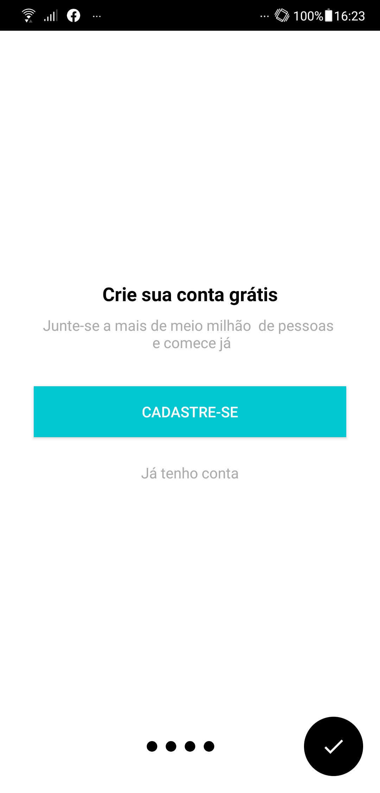

    <h1> Organizze App Clone </h1>

 

   

 
 

| | | | |
|:-------------------------:|:-------------------------:|:-------------------------:|:-------------------------:|
| | ||||
| | |
 

  <a href="#-the-project"> 📓 The Project</a>&nbsp;&nbsp;&nbsp;|&nbsp;&nbsp;&nbsp;
  <a href="#-target"> 💡 Target</a>&nbsp;&nbsp;&nbsp;|&nbsp;&nbsp;&nbsp;
  <a href="#-technologies"> 🔧 Technologies</a>&nbsp;&nbsp;&nbsp;|&nbsp;&nbsp;&nbsp;
  <a href="#-functionalities"> 🔎 Functionalities</a>&nbsp;&nbsp;&nbsp;|&nbsp;&nbsp;&nbsp;
  <a href="#-how-to-test"> 🧪 How to test</a>&nbsp;&nbsp;&nbsp;

## 📓 The Project 

 The Organizze App clone was built in order to improve native Android app development skills, correlated with learning non-relational databases, in this case, Firebase.

## 💡 Target

Organizze app clone, performing the basic functions of the application, in which was implemented Java language, using Firebase as a database

## 🔧 Technologies

 The main technologies that has been used in this project were: 

 
 |                  Type                  |                Tools                |                                 References                                  |
| :------------------------------------: | :---------------------------------: | :-------------------------------------------------------------------------: |
|       Programming Language (App)       |                JAVA                 |              https://docs.oracle.com/javase/tutorial/                       | 
|                   IDE                  |           ANDROID STUDIO            |              https://developer.android.com/studio                           |
|                 Testing                |               JUNIT5                |              https://junit.org/junit5/                                       |
|                 Database               |              FIREBASE               |              https://firebase.google.com/                                   |
|      Graphic components (Google)       |        GOOGLE MATERIAL DESIGN       |              https://material.io/                                           |
|         Material Intro (Slider)        |                SLIDER               |              https://github.com/heinrichreimer/material-intro               |
|      Floating Action Button (FAB)      |                 FAB                 |              https://github.com/Clans/FloatingActionButton                  |
|        Material (Calendar View)        |            CALENDAR VIEW            |              https://github.com/prolificinteractive/material-calendarview   |
 
 

| | | | |
|:-------------------------:|:-------------------------:|:-------------------------:|:-------------------------:|
| | | ||
  

 ## 🔎 Functionalities

 

    <ul>
      <li>Users Register and Login (E-mail Authentication)</li>
      <li>Add revenue and expense based on date, value and type</li>
      <li>Delete revenue or expense</li>
      <li>Navigate between dates to check the revenues and expenses from month/year</li>    
      <li>User total balance referring to all revenues and expenses entered</li>
     </ul>   
 

 ## 🧪 How to test

 After intalled Android Studio, it is necessary to set database, on this case Firebase, following the steps:
  

    <ul>
      <li>Create a Firebase account, if you don't have one</li>
      <li>Create a project on Firebase and link with Android Studio, by SHA-1 key (gradle/app//tasks/andoird/signingReport) and the base package of the project (AndroidManifests.xml) </li>
      <li>Set the Firebase Authentication, enabling only email</li>
      <li>Set the Firebase RealtimeDatabase, with the rule that any person can modify the database</li>    
      <li>Set the Firebase Storage</li>
      <li>Download and put google-services.json file into the folder indicated by Firebase</li>
      <li>Compile the project and run it via emulator or physically via smartphone ou tablet with Android system higher than 4.1 (Jelly Bean)</li>
      <li>Obs: Tested with MIUI Global 12.0.3</li>
     </ul>   
 

